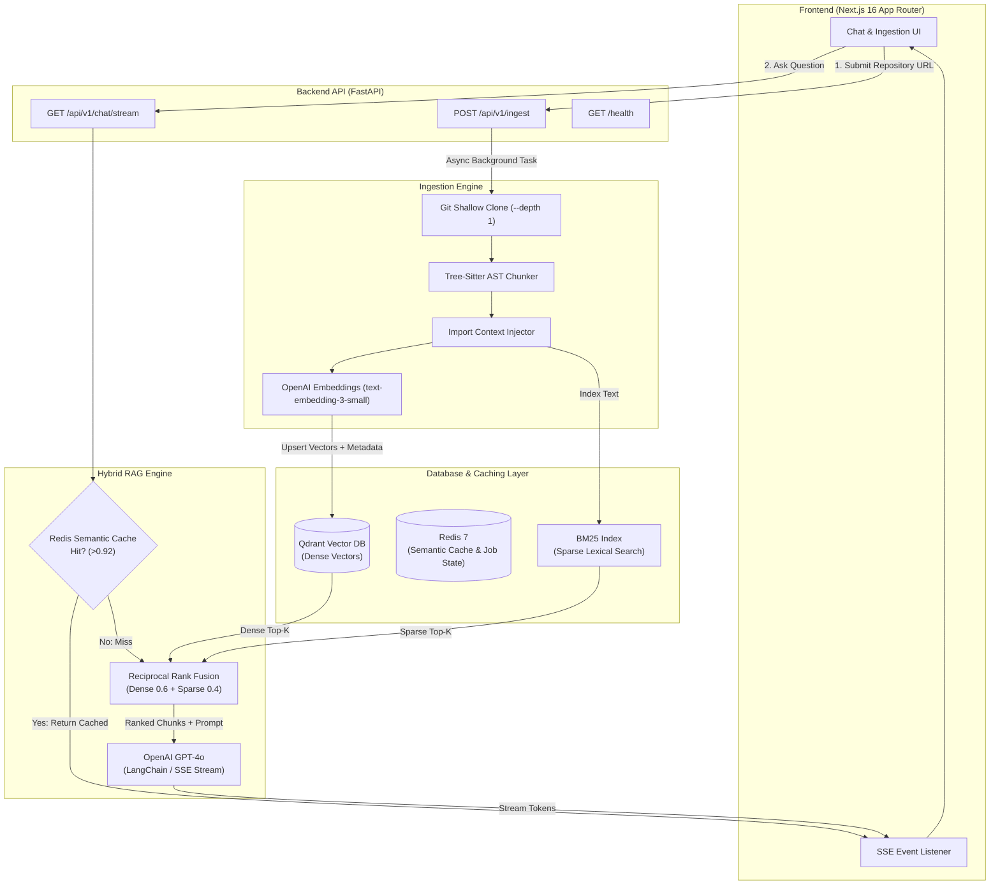

# 🐙 GitHub Repository Chat Assistant (GitTalk RAG)

[](https://fastapi.tiangolo.com/)
[](https://nextjs.org/)
[](https://openai.com/)
[](https://qdrant.tech/)
[](https://redis.io/)
[](https://tree-sitter.github.io/tree-sitter/)
[](https://www.docker.com/)

A **production-grade, AST-aware Retrieval-Augmented Generation (RAG) assistant** designed specifically for indexing, analyzing, and chatting with GitHub repositories in real time. 

Unlike conventional naive RAG systems that slice code by arbitrary line counts or character offsets, this system utilizes **Tree-Sitter AST (Abstract Syntax Tree) parsing** to extract semantic code structures (functions, classes, methods, interfaces) while retaining file-level import context. It fuses **Dense Vector Search (Qdrant)** with **Sparse Lexical Search (BM25)** via **Reciprocal Rank Fusion (RRF)**, leverages **Redis Semantic Caching** for instant repeat query lookup, and streams responses via **Server-Sent Events (SSE)** to a modern Next.js 16 frontend.

---

## 📑 Table of Contents

- [✨ Key Features](#-key-features)
- [🏗 System Architecture](#-system-architecture)
- [🛠 Tech Stack & Dependencies](#-tech-stack--dependencies)
- [📁 Project Directory Structure](#-project-directory-structure)
- [🔑 Environment Configuration](#-environment-configuration)
- [🚀 Quickstart Guide](#-quickstart-guide)
  - [Option A: Docker Compose (Recommended)](#option-a-docker-compose-recommended)
  - [Option B: Manual Local Setup](#option-b-manual-local-setup)
- [📡 API Reference](#-api-reference)
- [💡 Deep Dive: Core Engineering Concepts](#-deep-dive-core-engineering-concepts)
  - [1. AST Code Chunking & Context Preservation](#1-ast-code-chunking--context-preservation)
  - [2. Hybrid Retrieval (Dense Qdrant + Sparse BM25 via RRF)](#2-hybrid-retrieval-dense-qdrant--sparse-bm25-via-rrf)
  - [3. Redis Semantic Caching](#3-redis-semantic-caching)
  - [4. Real-time SSE Token Streaming](#4-real-time-sse-token-streaming)
- [🧪 Testing & Verification](#-testing--verification)
- [❓ Troubleshooting & FAQ](#-troubleshooting--faq)
- [📜 License](#-license)

---

## ✨ Key Features

- **🌲 Tree-Sitter AST Code Parsing**: Extracts syntactically complete code blocks (functions, async methods, classes, interfaces, type declarations, impl blocks) across 15+ programming languages (Python, JS, TS, TSX, Go, Rust, Java, C++, C#, etc.).
- **📦 Import & Global Context Prepending**: Automatically detects file-level import statements and prepends them to every chunk, ensuring the LLM understands unresolved types and dependencies within isolated code snippets.
- **🔀 Hybrid Dense + Sparse Retrieval**: Combines semantic embeddings (`text-embedding-3-small` in Qdrant) with exact keyword matching (`BM25Okapi`) fused together using Reciprocal Rank Fusion (RRF).
- **⚡ Redis Semantic Cache**: Computes vector cosine similarity against previous query embeddings in Redis. If similarity exceeds the configured threshold (default `0.92`), cached answers are served instantly with zero LLM API latency/cost.
- **🌊 Real-time SSE Token Streaming**: Full Server-Sent Events implementation allowing token-by-token answer generation directly to the UI alongside immediate source chunk attribution.
- **🎯 Precise Source Citations & Code Inspector**: Every answer displays expandable visual source cards showing exact file paths, line ranges (`start_line` to `end_line`), node types (e.g., `function`, `class`), and similarity scores.
- **🎨 Glassmorphic Next.js UI**: Dark-mode primary interface with live job status progress tracking, auto-scrolling chat window, syntax-highlighted code preview, and copy-to-clipboard capabilities.
- **🐳 Full Containerization**: One-command orchestrator with `docker-compose` setting up Qdrant Vector Database, Redis Cache, FastAPI Backend, and Next.js Frontend with health checks.

---

## 🏗 System Architecture



---

## 🛠 Tech Stack & Dependencies

### Backend (`/backend`)
- **Framework**: [FastAPI 0.111.1](https://fastapi.tiangolo.com/) with `uvicorn` and `asyncio`.
- **Parsing**: `tree-sitter` (0.22.3) and `tree-sitter-languages` (1.10.2).
- **Vector DB**: `qdrant-client` (1.9.1) & `langchain-qdrant`.
- **Lexical Search**: `rank-bm25` (0.2.2).
- **LLM & Embeddings**: `openai` (1.35.7), `langchain` (0.2.6), `langchain-openai`.
- **Cache / Job State**: `redis` (5.0.7) with `redis.asyncio`.
- **Git Operations**: `GitPython` (3.1.43) & `PyGithub` (2.3.0).
- **Streaming**: `sse-starlette` (2.1.2).
- **Validation & Logging**: `pydantic` v2, `pydantic-settings`, `structlog`.

### Frontend (`/frontend`)
- **Framework**: [Next.js 16](https://nextjs.org/) (App Router, React 19, TypeScript).
- **Styling**: [Tailwind CSS v4](https://tailwindcss.com/), custom glassmorphic dark theme.
- **Streaming Client**: `@microsoft/fetch-event-source` (2.0.1).
- **Code Display & Markdown**: `react-markdown`, `remark-gfm`, `react-syntax-highlighter`.
- **Icons**: `lucide-react`.

### Database & Infra (`docker-compose.yml`)
- **Qdrant Vector Engine**: `qdrant/qdrant:latest` (REST port `6333`, gRPC `6334`).
- **Redis**: `redis:7-alpine` (Port `6379`, persistent AOF + LRU eviction).

---

## 📁 Project Directory Structure

```directory
.
├── docker-compose.yml           # Orchestrates Qdrant, Redis, Backend, & Frontend
├── .env.example                 # Master environment variable template
├── README.md                    # System documentation (you are here)
│
├── backend/
│   ├── Dockerfile               # Multi-stage Python 3.11 build container
│   ├── requirements.txt         # Backend Python dependencies
│   ├── tests/
│   │   └── test_health.py       # API health check test suite
│   └── app/
│       ├── main.py              # FastAPI application entry point & CORS
│       ├── api/
│       │   └── v1/
│       │       ├── router.py    # Router aggregator (/api/v1)
│       │       └── endpoints/
│       │           ├── ingest.py # Ingestion endpoints (POST /ingest, GET /ingest/{id})
│       │           └── chat.py   # Chat endpoints (POST /chat, GET /chat/stream)
│       ├── core/
│       │   ├── config.py        # Pydantic v2 settings manager
│       │   └── logging.py       # Structured JSON logging configuration
│       ├── db/
│       │   └── qdrant_client.py # Qdrant connection pool & collection initialization
│       ├── models/
│       │   └── schemas.py       # Pydantic schemas (IngestRequest, ChatResponse, SSEEvent)
│       ├── parser/
│       │   └── ast_chunker.py   # Tree-Sitter AST code parser & fallback splitter
│       ├── rag/
│       │   ├── chain.py         # Prompt engineering & LLM generation logic
│       │   └── retriever.py     # Dense + Sparse RRF retriever & Redis cache
│       └── services/
│           ├── embed_service.py # OpenAI embeddings wrapper with retry logic
│           ├── github_service.py# Git repository cloner & tree walker
│           └── ingest_service.py# Async ingestion orchestrator & job tracker
│
└── frontend/
    ├── Dockerfile               # Production Next.js builder container
    ├── package.json             # Frontend NPM package config & scripts
    ├── tsconfig.json            # TypeScript configuration
    ├── next.config.ts           # Next.js router & API proxy settings
    ├── components/
    │   ├── IngestPanel.tsx      # Repository URL ingestion form & progress bar
    │   ├── ChatWindow.tsx       # Message thread viewport & streaming listener
    │   ├── MessageBubble.tsx    # Syntax-highlighted message renderer & badge metrics
    │   ├── SourcesDrawer.tsx    # Slide-over drawer detailing retrieved code chunks
    │   ├── ChatInput.tsx        # Auto-resizing user prompt input & actions
    │   └── StatusBadge.tsx      # Health & ingestion status indicator
    └── app/
        ├── layout.tsx           # Root HTML structure & font loading
        ├── page.tsx             # Main dashboard page assembling components
        └── globals.css          # Glassmorphism utilities & Tailwind imports
```

---

## 🔑 Environment Configuration

Create a `.env` file in the root directory by copying `.env.example`:

```bash
cp .env.example .env
```

### Key Configuration Parameters

| Parameter | Default Value | Description |
| :--- | :--- | :--- |
| **`OPENAI_API_KEY`** | `sk-...` *(Required)* | OpenAI API key for embeddings and GPT response generation. |
| **`OPENAI_MODEL`** | `gpt-4o` | LLM model name for answering code questions. |
| **`OPENAI_EMBEDDING_MODEL`**| `text-embedding-3-small` | OpenAI vector embedding model. |
| **`EMBEDDING_DIMENSION`** | `1536` | Output vector dimension size. |
| **`GITHUB_TOKEN`** | `ghp_...` *(Optional)* | GitHub PAT to prevent rate limiting on private/large public repos. |
| **`QDRANT_URL`** | `http://localhost:6333` | Vector database endpoint. |
| **`QDRANT_COLLECTION_NAME`**| `github_code_chunks` | Qdrant vector storage collection. |
| **`REDIS_URL`** | `redis://localhost:6379/0` | Redis instance for job state and semantic cache. |
| **`SEMANTIC_CACHE_THRESHOLD`**| `0.92` | Cosine similarity threshold to consider a cache hit. |
| **`CACHE_TTL_SECONDS`** | `3600` | Expiration time for cached responses (1 hour). |
| **`CHUNK_SIZE`** | `512` | Token target size for AST & fallback chunkers. |
| **`TOP_K`** | `8` | Number of relevant chunks retrieved per query. |
| **`DENSE_WEIGHT`** | `0.6` | Weight assigned to Qdrant vector retrieval score in RRF. |
| **`SPARSE_WEIGHT`** | `0.4` | Weight assigned to BM25 lexical retrieval score in RRF. |
| **`NEXT_PUBLIC_API_URL`**| `http://localhost:8000` | Backend API URL accessed by Next.js frontend. |

---

## 🚀 Quickstart Guide

### Option A: Docker Compose (Recommended)

Ensure you have [Docker Desktop](https://www.docker.com/products/docker-desktop/) installed.

1. **Clone the repository**:
   ```bash
   git clone https://github.com/your-username/github-repo-chat.git
   cd github-repo-chat
   ```

2. **Set environment variables**:
   ```bash
   cp .env.example .env
   # Edit .env and supply your OPENAI_API_KEY
   ```

3. **Start all services**:
   ```bash
   docker compose up --build
   ```

4. **Access the applications**:
   - **Frontend UI**: [http://localhost:3000](http://localhost:3000)
   - **FastAPI Interactive Docs**: [http://localhost:8000/api/docs](http://localhost:8000/api/docs)
   - **Qdrant Dashboard**: [http://localhost:6333/dashboard](http://localhost:6333/dashboard)

---

### Option B: Manual Local Setup

#### Prerequisites
- **Python**: 3.11 or 3.12
- **Node.js**: 18.x or 20.x
- **Services**: Local or cloud instances of **Qdrant** (`localhost:6333`) and **Redis** (`localhost:6379`).

#### 1. Spin up Qdrant & Redis in Docker
```bash
docker run -d --name qdrant -p 6333:6333 -p 6334:6334 qdrant/qdrant:latest
docker run -d --name redis -p 6379:6379 redis:7-alpine
```

#### 2. Backend Setup
```bash
cd backend

# Create virtual environment
python -m venv venv
# Activate virtual environment (Windows)
.\venv\Scripts\activate
# Activate virtual environment (Linux/macOS)
# source venv/bin/activate

# Install dependencies
pip install -r requirements.txt

# Run FastAPI dev server
uvicorn app.main:app --reload --host 0.0.0.0 --port 8000
```

#### 3. Frontend Setup
```bash
cd frontend

# Install dependencies
npm install

# Run Next.js development server
npm run dev
```

Open [http://localhost:3000](http://localhost:3000) in your browser.

---

## 📡 API Reference

Full OpenAPI documentation is served interactively at `http://localhost:8000/api/docs`.

### 1. Health Check
- **`GET /health`**
  - **Response**:
    ```json
    {
      "status": "ok",
      "version": "1.0.0",
      "env": "development"
    }
    ```

---

### 2. Ingest GitHub Repository
- **`POST /api/v1/ingest`**
  - **Request Body**:
    ```json
    {
      "repo_url": "https://github.com/tiangolo/fastapi",
      "branch": "main",
      "force_reindex": false
    }
    ```
  - **Response** `(202 Accepted)`:
    ```json
    {
      "job_id": "9b1deb4d-3b7d-4bad-9bdd-2b0d7b3dcb6d",
      "status": "pending",
      "repo_url": "https://github.com/tiangolo/fastapi",
      "branch": "main",
      "files_processed": 0,
      "chunks_indexed": 0,
      "error": null
    }
    ```

- **`GET /api/v1/ingest/{job_id}`**
  - **Response** `(200 OK)`:
    ```json
    {
      "job_id": "9b1deb4d-3b7d-4bad-9bdd-2b0d7b3dcb6d",
      "status": "completed",
      "repo_url": "https://github.com/tiangolo/fastapi",
      "branch": "main",
      "files_processed": 142,
      "chunks_indexed": 856,
      "error": null
    }
    ```

---

### 3. Ask Question / RAG Search

#### Synchronous Query
- **`POST /api/v1/chat`**
  - **Request Body**:
    ```json
    {
      "repo_id": "tiangolo_fastapi",
      "question": "How does FastAPI handle dependency injection?",
      "top_k": 8
    }
    ```
  - **Response**:
    ```json
    {
      "answer": "FastAPI handles dependency injection using `Depends()`...",
      "sources": [
        {
          "chunk_id": "c71a39f1...",
          "file_path": "fastapi/dependencies/utils.py",
          "start_line": 45,
          "end_line": 89,
          "node_type": "function",
          "node_name": "solve_dependencies",
          "language": "python",
          "score": 0.892,
          "snippet": "async def solve_dependencies(...):"
        }
      ],
      "cached": false,
      "latency_ms": 1140,
      "repo_id": "tiangolo_fastapi"
    }
    ```

#### Real-Time SSE Stream Query
- **`GET /api/v1/chat/stream?repo_id=tiangolo_fastapi&question=How+does+FastAPI+handle+dependency+injection?`**
  - **Event Stream Output**:
    ```http
    event: sources
    data: [{"chunk_id":"c71a39f1...", "file_path":"fastapi/dependencies/utils.py", ...}]

    event: token
    data: FastAPI

    event: token
    data:  uses

    event: token
    data:  the `Depends` function...

    event: done
    data: 
    ```

---

## 💡 Deep Dive: Core Engineering Concepts

### 1. AST Code Chunking & Context Preservation

Naive line-based chunking breaks code context across method boundaries, leading to syntax errors and hallucinated types. 

Our custom AST Chunker (`backend/app/parser/ast_chunker.py`) uses **Tree-Sitter** to parse the target file into a concrete syntax tree:
1. Traverses top-level declarations (`function_definition`, `class_definition`, `interface_declaration`, `method_declaration`).
2. Extracts file-level import headers (`import ...`, `from ... import ...`, `require(...)`).
3. Prepends import headers to every individual chunk payload (`import_context`), enabling the LLM to understand type origins even when looking at isolated functions.
4. Falls back gracefully to recursive token splitting for non-code files (Markdown, JSON, YAML).

---

### 2. Hybrid Retrieval (Dense Qdrant + Sparse BM25 via RRF)

Code questions often require both **conceptual matching** (e.g., *"How is user authentication verified?"*) and **exact keyword matching** (e.g., *"Where is `jwt_decode_handler` declared?"*).

We implement **Reciprocal Rank Fusion (RRF)** in `backend/app/rag/retriever.py`:

$$\text{RRF Score}(d) = w_{\text{dense}} \cdot \frac{1}{k + \text{rank}_{\text{dense}}(d)} + w_{\text{sparse}} \cdot \frac{1}{k + \text{rank}_{\text{sparse}}(d)}$$

- **Dense Retriever**: Qdrant vector index (`text-embedding-3-small`, 1536 dims).
- **Sparse Retriever**: In-memory `BM25Okapi` index constructed per repository.
- **RRF Fusion**: Ranks candidate documents across both indices ($k=60$) to construct the final Top-$K$ context window.

---

### 3. Redis Semantic Caching

To reduce latency from ~1.5s down to **< 20ms** and save OpenAI token costs, every incoming prompt query is embedded and evaluated against Redis:

1. Query embedding vector is calculated.
2. Evaluated against active cached query vectors in Redis via cosine similarity.
3. If $\text{CosineSimilarity}(Q_{\text{new}}, Q_{\text{cached}}) \ge 0.92$, the cached answer is returned immediately.
4. If no hit occurs, the answer is synthesized by the LLM and automatically saved to Redis with a configurable TTL (default 3600s).

---

### 4. Real-time SSE Token Streaming

Instead of waiting for the full response to synthesize, the application leverages Server-Sent Events via `sse-starlette` and Next.js `@microsoft/fetch-event-source`:

1. **Step 1 (`sources`)**: Backend immediately yields retrieved chunk references as JSON.
2. **Step 2 (`token`)**: LLM token chunks stream continuously as they are generated.
3. **Step 3 (`done`)**: Server signals completion and asynchronously writes the answer to the Redis semantic cache.

---

## 🧪 Testing & Verification

### Running Backend Unit & Integration Tests

The project includes pytest suites for endpoint verification:

```bash
cd backend
pytest tests/ -v
```

---

## ❓ Troubleshooting & FAQ

<details>
<summary><b>Q: Qdrant fails to connect on startup (qdrant.unreachable)</b></summary>
<br/>
Ensure that Qdrant is running on port <code>6333</code>. If running via Docker Compose, wait a few seconds for the Qdrant container healthcheck to pass before sending requests.
</details>

<details>
<summary><b>Q: Rate limit error when cloning large public repositories</b></summary>
<br/>
Set <code>GITHUB_TOKEN</code> in your <code>.env</code> file with a personal access token (PAT) to increase GitHub API limits.
</details>

<details>
<summary><b>Q: How do I re-index a repository if code changes?</b></summary>
<br/>
Pass <code>"force_reindex": true</code> in your <code>POST /api/v1/ingest</code> request or check the "Force Re-index" checkbox in the UI.
</details>

---

## 📜 License

This project is open-source and available under the [MIT License](LICENSE).
